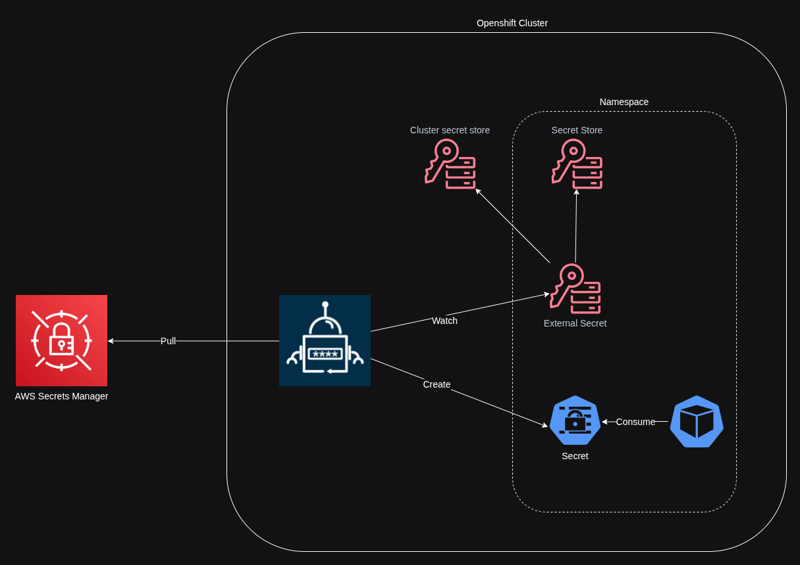

# External Secrets Operator — reference manifests

This folder contains **reference YAML** for configuring the **External Secrets Operator from Red Hat** on OpenShift. Use these files as a starting point when wiring external secret backends (for example **AWS Secrets Manager**) into Kubernetes `Secret` objects via the operator’s APIs (`SecretStore`, `ExternalSecret`, `ClusterExternalSecret`, and OpenShift `ExternalSecretsConfig`).

The examples assume a namespace such as `workshop` and illustrate credential references, store configuration, and both namespace-scoped and cluster-scoped external secret patterns. Adjust names, regions, and remote secret keys to match your environment.

## Architecture

The diagram below shows how the solution fits together (operator, stores, and synced secrets).

## Files (suggested order)

| File | Purpose |
|------|---------|
| `1-external-secrets-config.yaml` | OpenShift `ExternalSecretsConfig` — operator-level settings (for example network policy for the External Secrets controller). |
| `2-aws-credentials.yaml` | Kubernetes `Secret` holding AWS API credentials used by the store. **Replace placeholder values** with real credentials or use a more secure injection method in production. |
| `3-secrets-store.yaml` | `SecretStore` — connects to AWS Secrets Manager in a region and references the credential secret. |
| `4-external-secret.yaml` | Namespace-scoped `ExternalSecret` — maps remote secret properties into a target `Secret` in the same namespace. |
| `5-cluster-external-secret.yaml` | `ClusterExternalSecret` — repeats the sync pattern across namespaces selected by labels (pairs with a `ClusterSecretStore` when used cluster-wide). |

Install the **External Secrets Operator** from Red Hat on your cluster before applying these manifests, and ensure any `ClusterSecretStore` resources referenced by cluster-scoped objects exist and match your design.
